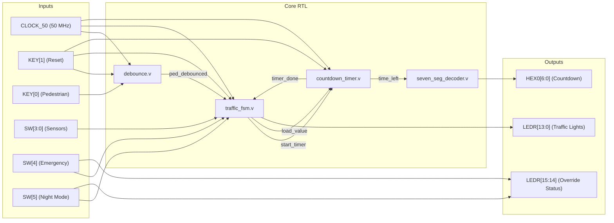
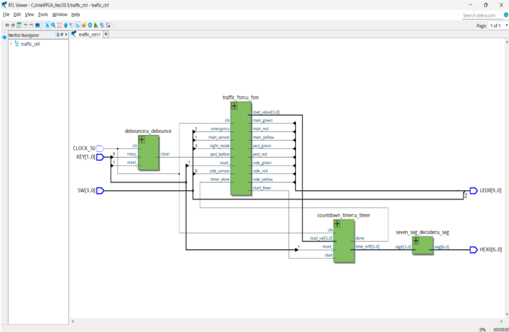

# Adaptive 4-Way FPGA Smart Traffic Light Controller

[](LICENSE)
[](docs/Project_Report.md)
[](verilog/)
[](quartus/)

A high-performance, deterministic, and hardware-efficient **4-Way Adaptive Traffic Light Controller** implemented in synthesizable Verilog. Designed and physically verified on the **Altera/Intel Cyclone IV E (EP4CE115F29C7)** FPGA development board, this design leverages hardware parallelism to deliver zero-latency traffic regulation.

Features include **dynamic vehicle sensor extensions**, a **latch-based pedestrian crossing**, an **emergency vehicle priority override**, and a **night caution mode**.

---

## 📖 Table of Contents
1. [Project Overview](#-project-overview)
2. [Key Features](#-key-features)
3. [Repository Structure](#-repository-structure)
4. [Hardware Configuration](#-hardware-configuration)
5. [System Architecture](#-system-architecture)
6. [Simulation & Verification](#-simulation--verification)
7. [Quartus Prime Compilation & Programming](#-quartus-prime-compilation--programming)
8. [License](#-license)

---

## 🚦 Project Overview

Traditional traffic controllers cycle through fixed timers, resulting in unnecessary delays and fuel wastage when intersections are empty. This project addresses urban traffic congestion using a **Finite State Machine (FSM)** that adapts dynamically:
*   Vehicle presence sensors extend green times for busy lanes.
*   Pedestrians can request a crossing phase on-demand via a push button.
*   First responders (ambulances, fire trucks) receive immediate priority access.
*   Late-night flashing modes conserve energy and warn drivers.

---

## ✨ Key Features

*   **Fully Parallel FSM:** Deterministic, hazard-free state changes.
*   **Dynamic Flow Extension:** Sw[3:0] mimic vehicle sensors. If a sensor is active, it extends the current road's green time by 2 seconds (capped at 9 seconds).
*   **Mechanical Bounce Filtering:** Active-low pedestrian button input is debounced using a digital filter to prevent multiple triggers.
*   **Emergency Priority System:** Instantly forces a green light on the Main Road (Road 0) while setting all other signals to red.
*   **Night Caution Mode:** Disables active sequencing, enabling a flashing yellow pattern on the Main Road and red on the other lanes.
*   **Physical Countdown Timer:** Drives the onboard 7-segment display (`HEX0`) to output remaining seconds in real-time.

---

## 📁 Repository Structure

```
fpga-smart-traffic-controller/
├── README.md                 # Project landing page and user guide
├── LICENSE                   # MIT License
├── .gitignore                # Git ignore patterns for Quartus Prime & ModelSim
│
├── docs/
│   └── Project_Report.md     # Detailed academic project report
│
├── verilog/                  # Synthesizable RTL source files
│   ├── traffic_ctrl.v        # Top-level module wrapper
│   ├── traffic_fsm.v         # Main control state machine
│   ├── countdown_timer.v     # Dynamic 1 Hz countdown timer
│   ├── debounce.v            # Pedestrian button debouncer
│   └── seven_seg_decoder.v   # Seven-segment display decoder
│
├── simulation/               # RTL simulation testbench
│   └── tb_traffic_ctrl.v     # Comprehensive testbench file
│
└── quartus/                  # Intel Quartus Prime project configuration
    ├── traffic_ctrl.qpf      # Quartus project file
    └── traffic_ctrl.qsf      # Quartus settings and pin assignments
```

---

## 🛠 Hardware Configuration

Designed for the **Terasic Altera DE2-115** development board:
*   **FPGA Device:** Cyclone IV E EP4CE115F29C7
*   **System Clock:** 50 MHz (`PIN_Y2` oscillator)
*   **Reset:** Active-low push-button `KEY[1]` (`PIN_M21`)
*   **Pedestrian Button:** Active-low push-button `KEY[0]` (`PIN_M23`)
*   **Vehicle Sensors:** Slide switches `SW[3:0]` for Roads 3, 2, 1, 0 respectively
*   **Emergency Mode:** Slide switch `SW[4]` (`PIN_AB27`)
*   **Night Mode:** Slide switch `SW[5]` (`PIN_AC26`)

*For a detailed pinout mapping table of LEDs (`LEDR[15:0]`) and the seven-segment display (`HEX0`), refer to the [Project Report](docs/Project_Report.md#pin-configurations-altera-de2-115).*

---

## 📐 System Architecture

### RTL Block Diagram
The top-level [traffic_ctrl.v](verilog/traffic_ctrl.v) connects individual modules. Signals flow dynamically from the inputs to the state machine, triggering the countdown timer and updating visual displays:





*For details about states and transitions, read [docs/Project_Report.md](docs/Project_Report.md#2-system-design--signal-flow).*

---

## 💻 Simulation & Verification

We provide a comprehensive testbench [tb_traffic_ctrl.v](simulation/tb_traffic_ctrl.v) to verify functionality before board programming. The testbench overrides clock divisors internally to run simulations in microseconds.

### Steps to Simulate in ModelSim
For automated execution, compile, signal plotting, and zoom setup, we provide a ModelSim run script:

1.  Launch **ModelSim-Intel FPGA Edition**.
2.  Select **File $\rightarrow$ Change Directory...** and select the `simulation/` directory of the project.
3.  In the ModelSim console, type:
    ```tcl
    do run_sim.do
    ```
This script will compile all files, load the testbench, add top-level ports and internal FSM states to the Wave window, run the full test suite, and zoom to fit the waveform display automatically. Alternatively, you can run manually:
```tcl
vlib work
vlog ../verilog/*.v tb_traffic_ctrl.v
vsim work.tb_traffic_ctrl
run -all
```

---

## 🔌 Quartus Prime Compilation & Programming

To compile the project and program the FPGA:

1.  Open **Intel Quartus Prime**.
2.  Go to **File $\rightarrow$ Open Project...**, locate the `quartus/` folder, and select [traffic_ctrl.qpf](quartus/traffic_ctrl.qpf).
3.  Click **Processing $\rightarrow$ Start Compilation** (or press `Ctrl+L`).
4.  Once compiled, open the **Programmer** utility (**Tools $\rightarrow$ Programmer**).
5.  Select **Hardware Setup** and choose **USB-Blaster**.
6.  Click **Add File...**, navigate to `quartus/output_files/`, and select the compiled programming file `traffic_ctrl.sof`.
7.  Check the **Program/Configure** box and click **Start** to program the Cyclone IV chip.

---

## 📄 License

This project is licensed under the MIT License - see the [LICENSE](LICENSE) file for details.
