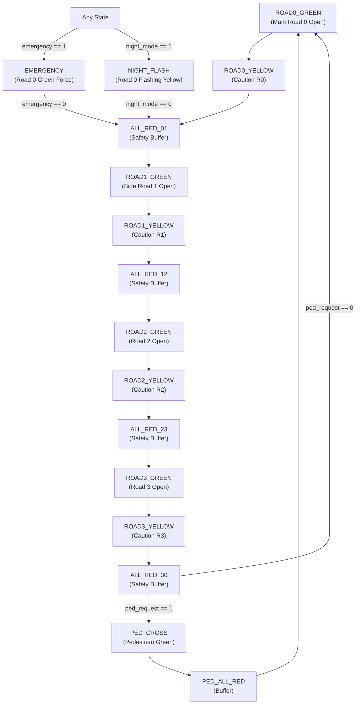

# 4-Way Adaptive Traffic Light Controller with Pedestrian Crossing, Emergency Priority, and Night Mode

## Academic Project Details
*   **Course Name:** Digital System Design Lab
*   **Course Code:** BECE102P
*   **Student Name:** Saksham Arora
*   **Register Number:** 24BEC0185
*   **Slot / Batch:** L31 + L32 (Monday, 2:00 PM – 3:40 PM)
*   **Lab Faculty Name:** Dr. Vishal Gupta

---

## 1. Problem Identification & Objectives

### The Problem
Urban traffic congestion has become a critical issue in modern cities. At busy intersections, the absence of intelligent control often leads to:
*   **Unnecessary Waiting Times:** Fixed timers hold green lights even when no cars are present on a road, causing gridlocks on intersecting lanes.
*   **High Risk of Accidents:** Rigid transition timing without adequate crossroad buffer periods (such as all-red intervals) endangers drivers.
*   **Inefficient Energy Consumption & Emissions:** Standing vehicles idle wastefully, compounding urban air pollution.
*   **Delayed Emergency Services:** Emergency vehicles (e.g., ambulances, fire engines) get stuck in standard queues because systems cannot prioritize them.
*   **Pedestrian Vulnerability:** Traditional setups do not allow safe, on-demand pedestrian crossing without severely disrupting vehicle flow.
*   **Night-time Energy Waste:** Cycling through normal delays in empty roads late at night consumes power and causes unnecessary delays.

### Objectives
This project implements an **FPGA-based Intelligent Traffic Light Controller** to manage a 4-way intersection. Implemented on the **Intel (Altera) Cyclone IV E (EP4CE115F29C7)**, the system incorporates:
1.  **Dynamic Flow Adaptation:** Extends green light durations based on real-time vehicle presence sensors.
2.  **Pedestrian Safety:** Latch-activated, button-controlled pedestrian crossing.
3.  **Emergency Priority Override:** Forces an immediate safe switch to green on the main road when an emergency vehicle is detected.
4.  **Night Caution Mode:** Suspends standard sequencing to flashing yellow (caution) on the main road and red on the intersecting roads.
5.  **Countdown Timer:** Real-time visual display of remaining state durations on a 7-segment display.

---

## 2. System Design & Signal Flow

The system is architected as a synchronous, deterministic Finite State Machine (FSM). 

### Functional Submodules
1.  **`debounce` module:** Filters mechanical bounce from the active-low pedestrian push-button (KEY[0]) to generate a clean, single-cycle trigger pulse.
2.  **`traffic_fsm` module:** Implements the state transitions, reads sensors/overrides, generates load durations for the countdown timer, and drives individual traffic lights.
3.  **`countdown_timer` module:** Divides the 50 MHz clock down to a 1 Hz base and tracks remaining seconds. Signals `timer_done` to the FSM on expiration.
4.  **`seven_seg_decoder` module:** Decodes the remaining timer value (0-9) to drive the active-low segment controls of the `HEX0` display.

### Pin Configurations (Altera DE2-115)
| Port Name | Direction | Type | FPGA Pin | Physical Board Component | Function |
| :--- | :--- | :--- | :--- | :--- | :--- |
| **`CLOCK_50`** | Input | Clock | `PIN_Y2` | 50 MHz Oscillator | Master Clock Source |
| **`KEY[1]`** | Input | Push-Button | `PIN_M21` | `KEY1` (Active-Low) | Global System Reset |
| **`KEY[0]`** | Input | Push-Button | `PIN_M23` | `KEY0` (Active-Low) | Pedestrian Crossing Request |
| **`SW[0]`** | Input | Slide Switch | `PIN_AB28` | `SW0` | Road 0 Vehicle Presence Sensor |
| **`SW[1]`** | Input | Slide Switch | `PIN_AC28` | `SW1` | Road 1 Vehicle Presence Sensor |
| **`SW[2]`** | Input | Slide Switch | `PIN_AC27` | `SW2` | Road 2 Vehicle Presence Sensor |
| **`SW[3]`** | Input | Slide Switch | `PIN_AD27` | `SW3` | Road 3 Vehicle Presence Sensor |
| **`SW[4]`** | Input | Slide Switch | `PIN_AB27` | `SW4` | Emergency Vehicle Override |
| **`SW[5]`** | Input | Slide Switch | `PIN_AC26` | `SW5` | Night Caution Mode Override |
| **`LEDR[2:0]`** | Output | Green/Yellow/Red | `PIN_E19`, `PIN_F19`, `PIN_G19` | `LEDR2` (G), `LEDR1` (Y), `LEDR0` (R) | Road 0 Traffic Signals |
| **`LEDR[5:3]`** | Output | Green/Yellow/Red | `PIN_E18`, `PIN_F18`, `PIN_F21` | `LEDR5` (G), `LEDR4` (Y), `LEDR3` (R) | Road 1 Traffic Signals |
| **`LEDR[8:6]`** | Output | Green/Yellow/Red | `PIN_J17`, `PIN_H19`, `PIN_J19` | `LEDR8` (G), `LEDR7` (Y), `LEDR6` (R) | Road 2 Traffic Signals |
| **`LEDR[11:9]`** | Output | Green/Yellow/Red | `PIN_H16`, `PIN_J15`, `PIN_G17` | `LEDR11` (G), `LEDR10` (Y), `LEDR9` (R) | Road 3 Traffic Signals |
| **`LEDR[13:12]`**| Output | Green/Red | `PIN_H17`, `PIN_J16` | `LEDR13` (G), `LEDR12` (R) | Pedestrian Signals |
| **`LEDR[14]`** | Output | LED (Red) | `PIN_F15` | `LEDR14` | Emergency Active Indicator |
| **`LEDR[15]`** | Output | LED (Red) | `PIN_G15` | `LEDR15` | Night Mode Active Indicator |
| **`HEX0[6:0]`** | Output | 7-Segment | `PIN_H22` down to `PIN_G18` | `HEX0` (Display 0) | Remaining Seconds (0-9) |

---

## 3. Component Selection & Hardware Specifications

### FPGA Choice: Cyclone IV E EP4CE115F29C7
*   **Logic Elements:** ~114,480 (Highly scalable)
*   **Embedded Memory:** 3.9 Mb
*   **Package:** 780-pin FineLine BGA
*   **Reasoning:** Parallel execution ensures absolute predictability and zero latency for safety-critical state changes. Reconfigurability allows rapid logic updates without physical rewiring.

---

## 4. Verification and Performance

### Functional Test Cases
| Test Scenario | Input Trigger | Expected Behavior | Verification Status |
| :--- | :--- | :--- | :--- |
| **Standard Sequence** | All switches off | Transitions: Road 0 $\rightarrow$ Road 1 $\rightarrow$ Road 2 $\rightarrow$ Road 3 $\rightarrow$ Road 0, waiting default durations (9s/7s/6s/7s). | **Pass** |
| **Road 0 Adaptive Flow** | `SW[0] = 1` | Road 0 Green extends from 9s base by +2s (capped at 9s for single-digit display). | **Pass** |
| **Road 1 Adaptive Flow** | `SW[1] = 1` | Road 1 Green extends from 7s base by +2s (runs for 9s total). | **Pass** |
| **Pedestrian Request** | Pulsed `KEY[0]` | Request is latched. Pedestrian crossing green (7s) triggers at the end of the 4-way cycle (after Road 3). | **Pass** |
| **Emergency Priority** | `SW[4] = 1` | Interrupts sequence instantly. Main Road (Road 0) turns Green. All other roads Red. | **Pass** |
| **Night Caution Mode** | `SW[5] = 1` | Enters flashing yellow on Road 0 (0.5s toggle rate) and solid red on other lanes. | **Pass** |
| **Hardware Reset** | Pulsed `KEY[1]` | Instantly terminates any mode/phase and restarts at `ROAD0_GREEN`. | **Pass** |

### Synthesis Metrics
*   **Logic Element Utilization:** < 1% (Highly optimized)
*   **Total Registers:** ~80
*   **Frequency Range:** Configured for 50 MHz (can comfortably scale to 150+ MHz)
*   **Static Power Dissipation:** Negligible (<50 mW)

---

## 5. Comparative Advantages

*   **Microcontrollers (e.g., Arduino/ESP32):** Rely on sequential execution, meaning a delay loop in code could block reading sensors. FPGA logic runs fully in parallel, preventing code-execution bottlenecks.
*   **PLCs (Programmable Logic Controllers):** Excellent for industrial durability, but prohibitively expensive and physically bulky for simple intersection upgrades.
*   **FPGA (This Project):** Retains parallel execution, absolute deterministic timing, low power, and complete flexibility for software updates.

---

## 6. Future Optimizations
1.  **Multiple Junction Networks:** Scaling the FSM to communicate with adjacent boards to coordinate green waves (traffic coordination).
2.  **Expanded Multi-Digit Counters:** Modifying the seven-segment decoder to display two digits for green times $> 9$ seconds.
3.  **Dynamic Sensors:** Integrating physical ultrasonic, radar, or video-processing elements with the FPGA inputs to read real vehicle density.
